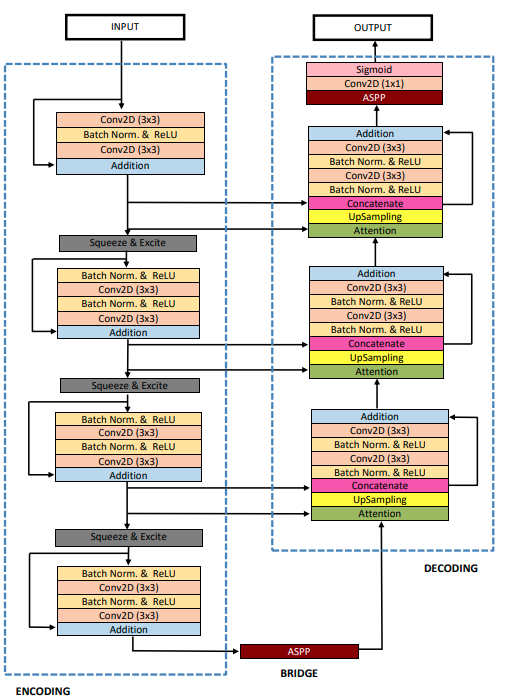
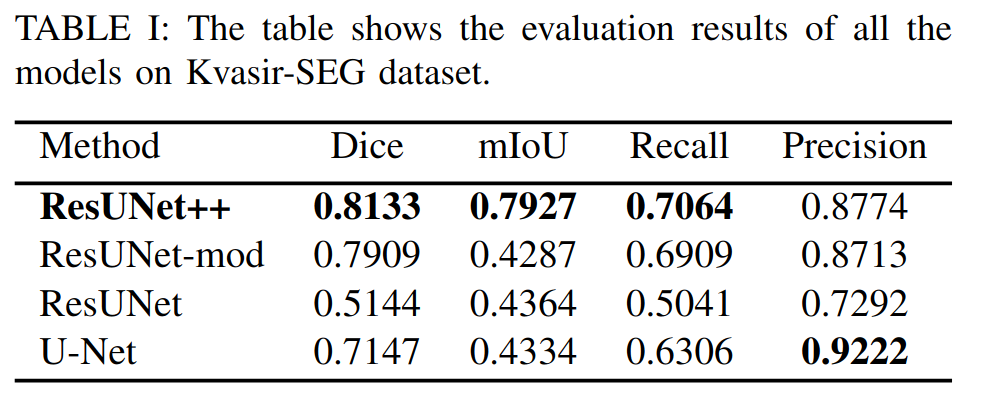
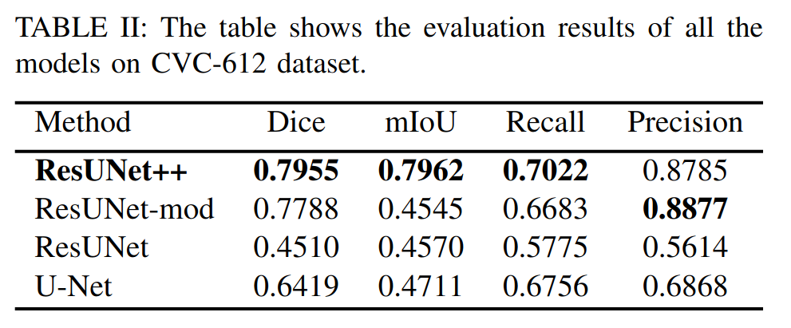
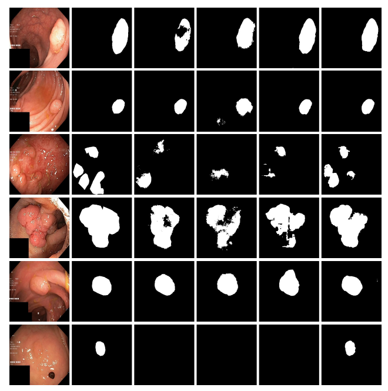

# ResUNet++: An Advanced Architecture for Medical Image Segmentation

ResUNet++ is an advanced and more accurate version of the standard U-Net and ResNet architectures, tailored specifically for medical image segmentation tasks. It was proposed to address certain limitations of U-Net and further enhance the accuracy and efficiency of medical image segmentation.

## Architecture

## Key Features:

**Modified Stem Block:** Unlike U-Net, ResUNet++ starts with a modified stem block that reduces the spatial dimensions of the input image.

**Residual Blocks:** Residual connections are employed in the encoder path. These connections bypass one or more layers and help in addressing the vanishing gradient problem, leading to deeper networks.

**Squeeze and excitation network**:  The Squeeze and exictation blocks provide dynamic channel-wise recalibration, enhancing the model's ability to focus on significant features.

**Attention Gates:** The architecture introduces attention gates to the skip connections, allowing the model to focus on specific features more prominently.

**Redesigned Decoder Path:** The decoder path of ResUNet++ employs up-convolution followed by a series of convolutions and is equipped with long-range skip connections to gather multi-scale contextual information.

**ASPP (Atrous Spatial Pyramid Pooling):** To capture multi-scale contextual information, ASPP is used in the last layer before the final output.

## Architecture Advantages:

- Improved accuracy for medical image segmentation.
- Efficient learning of hierarchical features.
- Ability to capture long-range spatial dependencies.

## Uses of ResUNet++:
- Medical Image Segmentation 
- General Image Segmentation
- Anomaly Detection in Medical Images 
- Comparative Studies

## Dataset Link
[Kvasir-SEG](https://datasets.simula.no/kvasir-seg/)

## Results

 **Qualitative results comparison on the Kvasir-SEG dataset.From the left: image (1), (2) Ground truth, (3) U-Net, (4)
ResUNet, (5) ResUNet-mod, and (6) ResUNet++.**  

## Citation
Please cite our paper if you find the work useful: 
<pre>
@INPROCEEDINGS{8959021,
  author={D. {Jha} and P. H. {Smedsrud} and M. A. {Riegler} and D. {Johansen} and T. D. {Lange} and P. {Halvorsen} and H. {D. Johansen}},
  booktitle={Proceedings of the IEEE International Symposium on Multimedia (ISM)}, 
  title={ResUNet++: An Advanced Architecture for Medical Image Segmentation}, 
  year={2019},
  pages={225-230}}
</pre>

## Contact
Please contact debesh.jha@northwestern.edu for any further questions.
